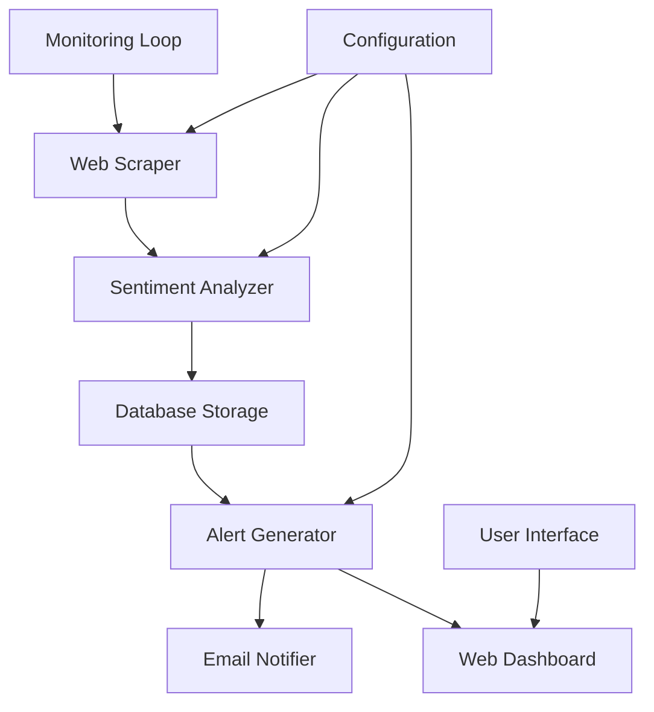

# 🤖Sentiment Monitor [Customer Sentiment Alert System]

A comprehensive real-time monitoring system that tracks customer sentiment across reviews, social media, and forums, providing instant alerts to support teams when negative sentiment is detected.

## 🚀 Features

- **Real-time Sentiment Analysis**: Advanced NLP using multiple models (VADER, TextBlob, Transformer)
- **Multi-source Monitoring**: Reviews (Trustpilot, Yelp, Google), Social Media (Twitter, Reddit), Forums (Stack Overflow, Quora)
- **Intelligent Alerting**: Urgency-based alerts with response recommendations
- **Email Notifications**: Beautiful HTML email templates with actionable insights
- **Web Dashboard**: Real-time monitoring dashboard with statistics and alerts
- **Configurable Monitoring**: Customizable keywords, companies, and thresholds
- **Data Persistence**: SQLite database with comprehensive logging

## 📱 Screenshots

### Dashboard Overview

*Real-time sentiment monitoring with interactive charts*

### Alert Management

*Comprehensive alert management with response recommendations*

### Email Notifications

*Professional HTML email templates for different urgency levels*


## 📁 Project Structure

```
customer-sentiment-alert-system/
├── 📁 templates/           # HTML templates for web dashboard
│   ├── base.html          # Base template with navigation
│   ├── dashboard.html     # Main dashboard with charts
│   ├── alerts.html        # Alert management interface
│   ├── statistics.html    # Statistics and analytics
│   └── configuration.html # System configuration
├── 📁 static/             # Static assets (CSS, JS)
│   ├── css/              # Custom stylesheets
│   └── js/               # JavaScript files
├── 🐍 app.py             # Flask web application
├── 🐍 sentiment_monitor.py # Main monitoring system
├── 🐍 sentiment_analyzer.py # NLP sentiment analysis engine
├── 🐍 web_scraper.py     # Multi-platform web scraping
├── 🐍 email_notifier.py  # Email notification system
├── 🐍 database.py        # Database management
├── 🐍 config.py          # Configuration management
├── 🐍 run.py             # Main entry point
├── 🐍 install.py         # Automated installation script
├── 🐍 restart_app.py     # Application restart utility
├── 📄 requirements.txt   # Full dependencies
├── 📄 requirements_lite.txt # Lightweight dependencies
├── 📄 .env               # Environment configuration
├── 📄 env_example.txt    # Environment template
├── 🗄️ sentiment_alerts.db # SQLite database
└── 📄 sentiment_alerts.log # Application logs
```

## 🔄 System Flow



## ‼️Flow Description
1. **Web Scraper** monitors multiple platforms for mentions
2. **Sentiment Analyzer** processes text using multiple NLP models
3. **Database** stores analysis results and metadata
4. **Alert Generator** creates alerts based on sentiment thresholds
5. **Email Notifier** sends formatted alerts to support teams
6. **Web Dashboard** provides real-time monitoring interface

## 📋 Requirements

- Python 3.8+
- Chrome/Chromium browser (for web scraping)
- Email account for SMTP (Gmail recommended)
- Optional: Twitter API credentials for enhanced social media monitoring

## 🛠️ Quick Start

### Option 1: Automated Installation
```bash
# Clone repository
git clone https://github.com/yourusername/customer-sentiment-alert-system.git
cd customer-sentiment-alert-system

# Run automated installer
python install.py

# Configure your settings
nano .env  # Edit with your credentials
nano config.py  # Add your company names

# Start the system
python run.py
```

### Option 2: Manual Installation

1. **Clone the repository**
   ```bash
   git clone https://github.com/yourusername/customer-sentiment-alert-system.git
   cd customer-sentiment-alert-system
   ```

2. **Install dependencies**
   ```bash
   # For full features
   pip install -r requirements.txt
   
   # For lightweight installation
   pip install -r requirements_lite.txt
   ```

3. **Install ChromeDriver**
   ```bash
   # Windows (using chocolatey)
   choco install chromedriver
   
   # macOS (using homebrew)
   brew install chromedriver
   
   # Linux (manual)
   wget https://chromedriver.storage.googleapis.com/LATEST_RELEASE
   # Download and add to PATH
   ```

4. **Configure environment**
   ```bash
   cp env_example.txt .env
   ```
   
   Edit `.env` with your settings:
   ```env
   # Email Configuration (Required)
   EMAIL_USERNAME=your-email@gmail.com
   EMAIL_PASSWORD=your-app-password
   ALERT_EMAIL=support@yourcompany.com
   
   # Twitter API (Optional)
   TWITTER_API_KEY=your_api_key
   TWITTER_API_SECRET=your_api_secret
   TWITTER_ACCESS_TOKEN=your_access_token
   TWITTER_ACCESS_TOKEN_SECRET=your_access_token_secret
   
   # Monitoring Settings
   MONITORING_INTERVAL=300
   SENTIMENT_THRESHOLD=-0.3
   ```

5. **Update configuration**
   Edit `config.py`:
   ```python
   COMPANY_NAMES = [
       'YourCompany',
       'YourBrand', 
       'YourProduct'
   ]
   
   MONITOR_KEYWORDS = [
       'customer service', 'support', 'complaint',
       'issue', 'problem', 'refund', 'cancel'
   ]
   ```

## 🚀 Usage

### Start Complete System
```bash
python run.py
```
Access dashboard at `http://localhost:5000`

### Start Components Separately
```bash
# Terminal 1: Web Dashboard
python app.py

# Terminal 2: Monitoring System
python sentiment_monitor.py
```

### Restart System
```bash
python restart_app.py
```

## 📊 Dashboard Features

### 🏠 Main Dashboard
- **Real-time Statistics**: Live sentiment metrics and trends
- **Active Alerts Overview**: Current alerts by urgency level
- **Recent Negative Sentiment**: Latest concerning feedback
- **Interactive Charts**: Sentiment distribution and source analysis
- **System Status**: Monitoring health indicators

### 🚨 Alerts Management
- **Urgency Filtering**: Critical, High, Medium, Low priority alerts
- **Detailed Feedback View**: Full customer comments and context
- **Response Recommendations**: AI-generated response suggestions
- **Email Status Tracking**: Notification delivery confirmation
- **Alert Resolution**: Mark alerts as resolved

### 📈 Statistics & Analytics
- **Sentiment Distribution**: Positive/Negative/Neutral breakdown
- **Source Analysis**: Platform-wise mention tracking
- **Urgency Trends**: Alert severity over time
- **Historical Data**: Configurable time period analysis

### ⚙️ Configuration Panel
- **System Health**: Component status monitoring
- **Manual Actions**: Test system, scan, send test emails
- **Environment Status**: Configuration validation
- **Log Management**: Real-time log viewing

## 🔧 Configuration Guide

### 📧 Email Setup (Gmail)
1. **Enable 2-Factor Authentication** in your Google account
2. **Generate App Password**:
   - Go to Google Account Settings → Security
   - Select "App passwords" under 2-Step Verification
   - Generate password for "Mail"
3. **Update .env file**:
   ```env
   EMAIL_USERNAME=your-email@gmail.com
   EMAIL_PASSWORD=generated-app-password
   ALERT_EMAIL=support@yourcompany.com
   ```

### 🐦 Twitter API Setup (Optional)
1. **Create Twitter Developer Account** at [developer.twitter.com](https://developer.twitter.com)
2. **Create New App** in the developer portal
3. **Generate Keys and Tokens**:
   - API Key and Secret
   - Access Token and Secret
4. **Add to .env file**:
   ```env
   TWITTER_API_KEY=your_api_key
   TWITTER_API_SECRET=your_api_secret
   TWITTER_ACCESS_TOKEN=your_access_token
   TWITTER_ACCESS_TOKEN_SECRET=your_access_token_secret
   ```

### 🎯 Monitoring Configuration

| Parameter | Description | Default | Range |
|-----------|-------------|---------|-------|
| `MONITORING_INTERVAL` | Check frequency (seconds) | 300 | 60-3600 |
| `SENTIMENT_THRESHOLD` | Negative threshold | -0.3 | -1.0 to 1.0 |
| `COMPANY_NAMES` | Brands to monitor | ['YourCompany'] | Array |
| `MONITOR_KEYWORDS` | Trigger keywords | ['complaint', 'issue'] | Array |

### 🎨 Customization

**Add Your Companies** in `config.py`:
```python
COMPANY_NAMES = [
    'Your Company Name',
    'Your Brand',
    'Your Product Line'
]
```

**Customize Keywords**:
```python
MONITOR_KEYWORDS = [
    # Service issues
    'customer service', 'support', 'help',
    # Problems
    'complaint', 'issue', 'problem', 'bug',
    # Negative emotions
    'disappointed', 'frustrated', 'angry',
    # Actions
    'refund', 'cancel', 'return'
]
```

## 📧 Email Templates

The system includes responsive HTML email templates:

| Template | Trigger | Features |
|----------|---------|----------|
| **🚨 Critical Alert** | Score < -0.7 | Red theme, immediate action items |
| **⚠️ High Priority** | Score < -0.5 | Orange theme, suggested actions |
| **📢 Medium Priority** | Score < -0.2 | Yellow theme, monitoring recommendations |
| **📊 Daily Summary** | Scheduled | Statistics, trends, top issues |

## 🗄️ Database Schema

```sql
-- Core sentiment analysis data
sentiment_analysis (
    id, text, sentiment_score, confidence,
    urgency_level, source, timestamp, metadata
)

-- Alert management
alerts (
    id, sentiment_id, urgency_level, message,
    email_sent, response_recommendation, status
)

-- Email tracking
email_logs (
    id, alert_id, recipient, subject, status, sent_at
)

-- Configuration storage
monitoring_config (
    id, company_name, keywords, sources, is_active
)
```

## 🔍 Monitoring Sources

### 🌟 Review Platforms
| Platform | Data Collected | API/Scraping |
|----------|----------------|---------------|
| **Trustpilot** | Reviews, ratings, dates | Web Scraping |
| **Yelp** | Reviews, ratings, business info | Web Scraping |
| **Google Reviews** | Reviews, ratings, location data | Web Scraping |

### 📱 Social Media
| Platform | Data Collected | API/Scraping |
|----------|----------------|---------------|
| **Twitter** | Tweets, mentions, engagement | Twitter API |
| **Reddit** | Posts, comments, scores | Reddit JSON API |

### 💬 Forums & Communities
| Platform | Data Collected | API/Scraping |
|----------|----------------|---------------|
| **Stack Overflow** | Questions, answers, tags | Web Scraping |
| **Quora** | Questions, answers, topics | Web Scraping |

## 🚨 Alert System

### 📊 Urgency Classification

| Level | Score Range | Confidence | Action Required |
|-------|-------------|------------|----------------|
| **🔥 Critical** | < -0.7 | > 80% | Immediate response |
| **⚠️ High** | < -0.5 | > 70% | Same day response |
| **📢 Medium** | < -0.2 | > 60% | Monitor closely |
| **ℹ️ Low** | < 0.0 | Any | Track trends |

### 🤖 AI Response Recommendations

The system generates contextual recommendations based on:
- **Sentiment Severity**: Response urgency and tone
- **Source Platform**: Platform-specific best practices
- **Content Analysis**: Issue categorization and solutions
- **Historical Patterns**: Successful resolution strategies

## 🛡️ Security & Best Practices

### 🔐 Security Measures
- **Environment Variables**: All credentials stored in `.env`
- **App Passwords**: Gmail integration with 2FA
- **API Key Rotation**: Regular credential updates
- **Input Validation**: Sanitized user inputs
- **Rate Limiting**: Respectful web scraping
- **HTTPS Ready**: Production SSL support

### ⚡ Performance Optimization

| Component | Optimization | Impact |
|-----------|--------------|--------|
| **Monitoring** | Adjust intervals (300-3600s) | Resource usage |
| **Database** | Auto-cleanup (30 days) | Storage management |
| **Scraping** | Concurrent requests | Speed improvement |
| **Analysis** | Batch processing | CPU efficiency |

### 📊 Scaling Recommendations
- **Small Team**: Default settings, 5-minute intervals
- **Medium Business**: 2-minute intervals, dedicated server
- **Enterprise**: Multiple instances, load balancing


#### Email Configuration
```bash
# Error: Email authentication failed
# Solution: Check Gmail App Password
1. Enable 2FA in Google Account
2. Generate App Password (not regular password)
3. Update EMAIL_PASSWORD in .env
```

#### Twitter API Issues
```bash
# Error: Twitter API rate limit
# Solution: Check API usage
1. Verify credentials in .env
2. Check rate limits in Twitter Developer Console
3. Reduce monitoring frequency if needed
```

#### Database Problems
```bash
# Error: Database locked
# Solution: Check permissions and processes
sudo chown $USER:$USER sentiment_alerts.db
killall python  # Stop conflicting processes
```

## 📄 License

This project is licensed under the **MIT License** - see the [LICENSE](LICENSE) file for details.

---

<div align="center">

**Built with ❤️ for customer support teams**

[](https://python.org)
[](https://flask.palletsprojects.com)
[](LICENSE)
[](CONTRIBUTING.md)

[⭐ Star this repo](https://github.com/Darshan0244/Sentiment-Monitor) • [🐛 Report Bug](https://github.com/Darshan0244/Sentiment-Monitor/issues) • [💡 Request Feature](https://github.com/Darshan0244/Sentiment-Monitor/discussions)

</div>